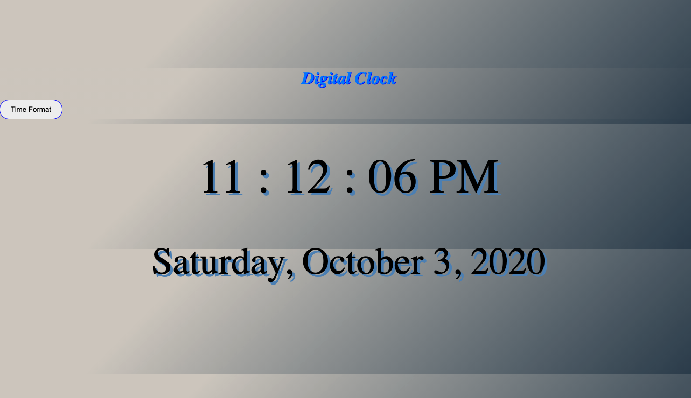

Welcome to my first project! It's a Digital Clock. 

Click [here](https://nagimenok.github.io/digital-clock/index.html) to check it out! 

**Summary** 

I have always been a curios person and wanted to know how things work behind the scene. 
That was one of the reasons for me to pursue my the Software Developer career. 

During this project I learned the basics of HTML, CSS and JavaScript, which triggered even more curiosity to keep on going and learn more about coding. It was chalenging but super fun! This is my first step into this path, so please enjoy :) 

**Author**

Nagima Rakhimova - *Software Developer* - [Linkedin](https://www.linkedin.com/in/nagima-r-445841a3/)

